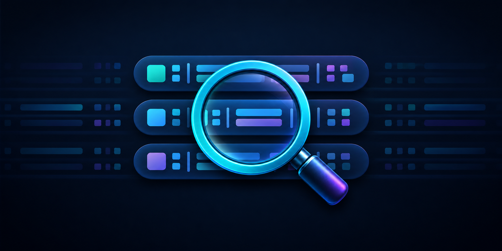

# V2 Lens — Public Beta



V2 Lens is a Racket library and desktop inspector for the structure of HL7 v2
messages. It builds an immutable tree while retaining every raw value and its
exact character span in the source message.

The prepared public beta is `v0.1.0-beta.1`. Its release matrix targets Racket
9.2 on Windows, macOS, and Linux. The beta tag and GitHub prerelease are created
separately through the release checklist after all three jobs pass.

V2 Lens handles structure only. It does not decode escapes, validate against
an HL7 schema, interpret clinical values, identify PHI, rewrite messages, or
save edits. The desktop application does not log message contents, use the
network, or persist source text automatically.

## Start here

- [Inspect your first message](docs/tutorial-first-inspection.md) is a guided
  lesson for new desktop-inspector users.
- [How to parse a message in Racket](docs/how-to-parse-a-message.md) shows how
  to handle complete and incomplete results in working code.
- [V2 Lens API reference](docs/reference.md) lists the parser's public data
  structures, functions, conventions, and diagnostics.
- [Understanding the structural model](docs/explanation-structural-model.md)
  explains why V2 Lens preserves raw text and spans without interpreting the
  message.

## Install from this checkout

```sh
raco pkg install --auto --name v2-lens
```

After the beta tag is published, install that exact release with:

```sh
raco pkg install --auto https://github.com/CodeDraig/v2-lens.git#v0.1.0-beta.1
```

## Launch the inspector

```sh
v2-lens
```

If Racket's user launcher directory is not on `PATH`, launch the installed
application through Racket instead:

```sh
racket -e '(require v2-lens/gui) (run-v2-lens)'
```

Paste an HL7 v2 message and choose **Parse**, or choose **Open…** to load and
immediately parse a UTF-8 `.hl7` or text file.

## Public beta limits

- The desktop inspector parses up to 5 MiB of UTF-8 message data.
- Files above 5 MiB remain available in **Raw Source** but are not parsed.
- Files above 100 MiB are rejected before they are read.
- Inputs with more than 50,000 possible structural delimiters remain raw.
- Large reports, fields, and diagnostic lists are loaded in bounded batches.

These limits apply only to the desktop inspector. The public
`parse-hl7-v2` library function retains its existing behavior and API.

## Parse from Racket

```racket
#lang racket/base

(require v2-lens)

(define result
  (parse-hl7-v2 "MSH|^~\\&|APP|FAC\rPID|1|DEMO-001"))

(displayln (hl7-parse-result-complete? result))
```

See [How to parse a message in Racket](docs/how-to-parse-a-message.md) for
result handling and tree navigation.

## Future scope

PHI identification and removal remain a separate future layer. Message
rewriting, decoded values, schema-aware labels, and saving edited messages are
also intentionally absent from this first inspector.

## Acknowledgments

V2 Lens was informed by Kenton Hamaluik's
[hl7-parser](https://github.com/hamaluik/hl7-parser) Rust project, which was
studied as an idea and reference source. V2 Lens is an independent Racket
implementation and does not claim API or behavioral compatibility with that
project.

## Feedback

Report reproducible beta problems through
[GitHub Issues](https://github.com/CodeDraig/v2-lens/issues). Security reports
should follow [SECURITY.md](SECURITY.md) instead of using a public issue.
